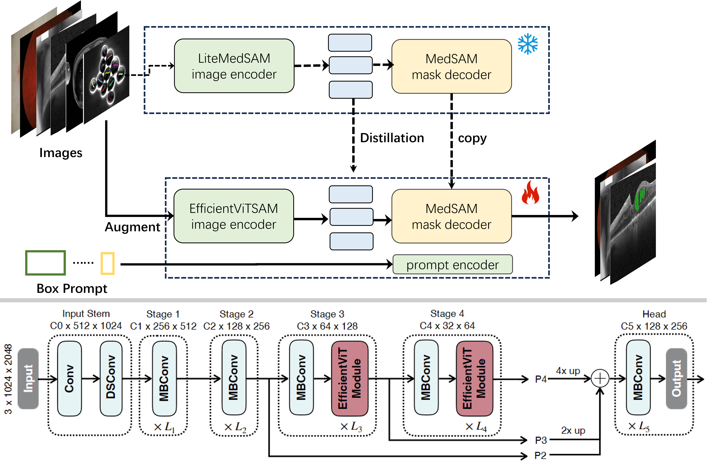
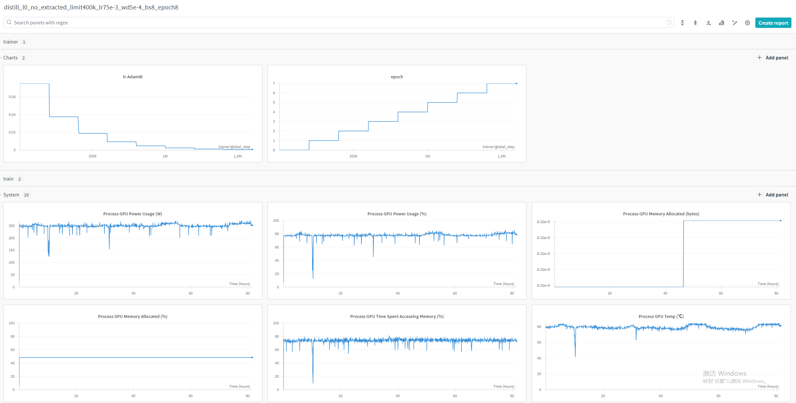
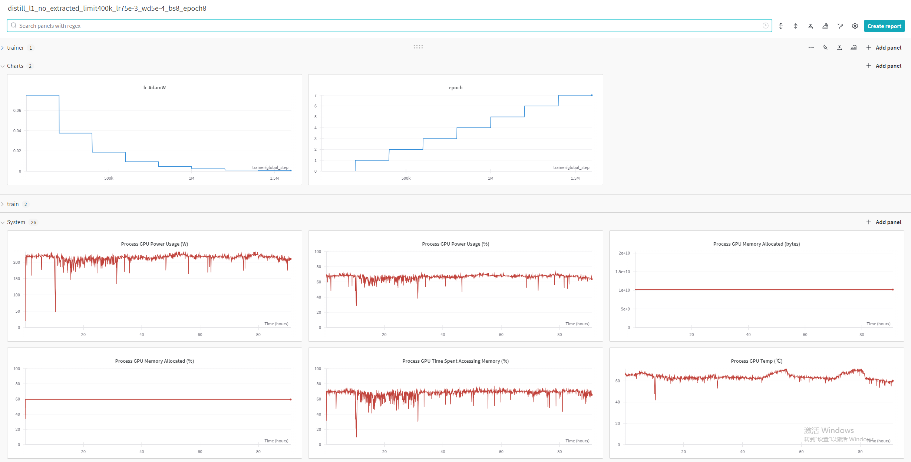
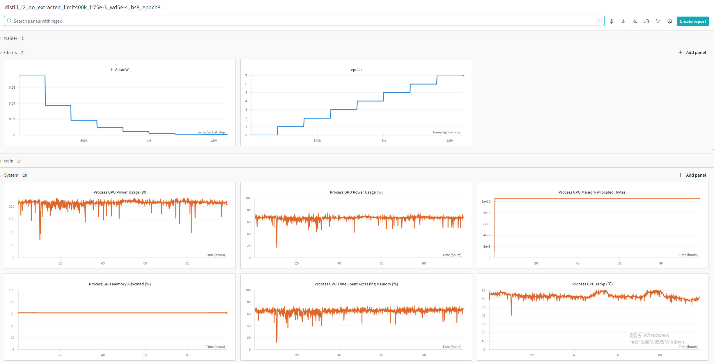
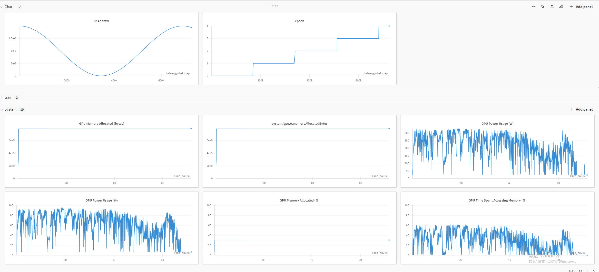
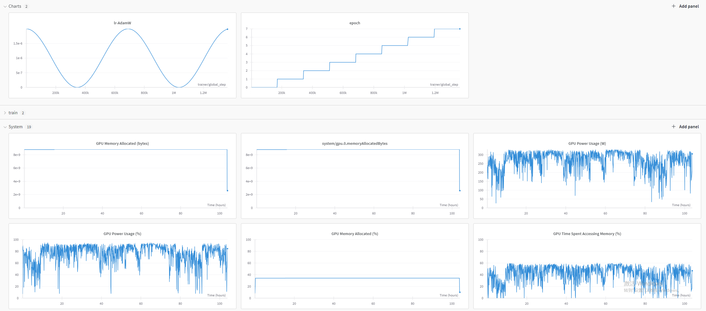
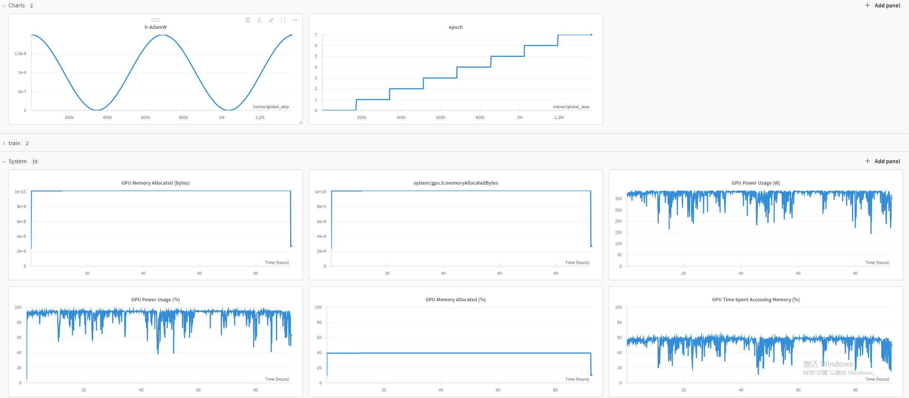

# <p align="center">MedficientSAM Reproduced</p>

<p align="center">


</p>

<p align="center">

</p>

### Environment and Requirements

| System                  | Ubuntu 22.04.5 LTS              |
| ----------------------- | ------------------------------- |
| CPU                     | Intel(R) Xeon(R) Silver 4114    |
| RAM                     | 128GB                           |
| GPU (number and type)   | One NVIDIA 4080 16G             |
| CUDA version            | 12.1                            |
| Programming language    | Python 3.10                     |
| Deep learning framework | torch 2.2.2, torchvision 0.17.2 |

## Reproduced Results

Accuracy metrics are evaluated on the public validation set of [CVPR 2024 Segment Anything In Medical Images On Laptop Challenge](https://www.codabench.org/competitions/1847/).
The computational metrics are obtained on an Intel(R) Core(TM) i9-10900K.

| Method            | Res. | Params | FLOPs  | DSC  | NSD  | DSC-R | NSD-R | 2D Runtime | 3D Runtime | 2D Memory Usage | 3D Memory Usage |
|-------------------|------|--------|--------|------|------|-------|-------|------------|------------|-----------------|-----------------|
| MedSAM            | 1024 | 93.74M | 488.24G| 84.91| 86.46| 84.91 | 86.46 | N/A        | N/A        | N/A             | N/A             |
| LiteMedSAM        | 256  | 9.79M  | 39.98G | 83.23| 82.71| 83.23 | 82.71 | 5.1s       | 42.6s      | 1135MB          | 1241MB          |
| MedficientSAM-L0  | 512  | 34.79M | 36.80G | 85.85| 87.05| 84.93 | 86.76 | 0.9s       | 7.4s       | 448MB           | 687MB           |
| MedficientSAM-L1  | 512  | 47.65M | 51.05G | 86.42| 87.95| 85.16 | 86.68 | 1.0s       | 9.0s       | 553MB           | 793MB           |
| MedficientSAM-L2  | 512  | 61.33M | 70.71G | 86.08| 87.53| 85.07 | 86.63 | 1.1s       | 11.1s      | 663MB           | 903MB           |


| Target     | LiteMedSAM DSC(%) | LiteMedSAM NSD(%) | Distillation DSC(%) | Distillation NSD(%) | Distillation-R DSC(%) | Distillation-R NSD(%) | No Augmentation DSC(%) | No Augmentation NSD(%) | No Augmentation-R DSC(%) | No Augmentation-R NSD(%) | MedficientSAM-L1 DSC(%) | MedficientSAM-L1 NSD(%) | MedficientSAM-L1-R DSC(%) | MedficientSAM-L1-R NSD(%) |
|------------|-------------------|-------------------|---------------------|---------------------|-----------------------|-----------------------|------------------------|------------------------|--------------------------|--------------------------|-------------------------|-------------------------|---------------------------|---------------------------|
| CT         | 92.26             | 94.90<sup>b</sup> | 91.13               | 93.75               | 92.15                 | 94.74                 | 92.24                  | 94.71                  | 92.69                    | 95.50<sup>b</sup>        | 92.15                   | 94.80                   | 93.19<sup>r</sup>         | 95.78<sup>r</sup>         |
| MR         | 89.63<sup>r</sup> | 93.37<sup>r</sup> | 85.73               | 89.75               | 87.87<sup>b</sup>     | 91.40                 | 87.25                  | 90.88                  | 88.54                    | 92.21<sup>b</sup>        | 86.98                   | 90.77                   | 89.51                     | 92.99                     |
| PET        | 51.58             | 25.17             | 70.49<sup>b</sup>   | 54.52<sup>b</sup>   | 68.30                 | 50.17                 | 72.05<sup>r</sup>      | 56.26<sup>r</sup>      | 61.06                    | 49.13                    | 73.00<sup>r</sup>       | 58.03<sup>r</sup>       | 66.97                     | 52.52                     |
| US         | 94.77<sup>r</sup> | 96.81<sup>r</sup> | 84.43               | 89.29               | 84.52<sup>b</sup>     | 89.37                 | 81.99                  | 86.74                  | 82.41                    | 87.16<sup>b</sup>        | 82.50                   | 87.24                   | 81.39                     | 86.09                     |
| X-Ray      | 75.83             | 80.39             | 78.92               | 84.64               | 75.40                 | 80.38                 | 79.88                  | 85.73<sup>r</sup>      | 78.04                    | 83.10                    | 80.47<sup>b</sup>       | 86.23<sup>r</sup>       | 75.78                     | 80.88                     |
| Dermoscopy | 92.47             | 93.85             | 92.84               | 94.16               | 92.54                 | 93.88                 | 94.24<sup>r</sup>      | 95.62<sup>r</sup>      | 93.71<sup>b</sup>        | 95.19<sup>b</sup>        | 94.16                   | 95.54                   | 93.17                     | 94.62                     |
| Endoscopy  | 96.04<sup>b</sup> | 98.11             | 96.88<sup>r</sup>   | 98.81<sup>r</sup>   | 95.92                 | 98.16                 | 96.05                  | 98.33                  | 95.58                    | 98.07<sup>b</sup>        | 96.10                   | 98.37                   | 94.62                     | 97.26                     |
| Fundus     | 94.81             | 96.41             | 94.10               | 95.83               | 93.85                 | 95.54                 | 94.16                  | 95.89                  | 94.27<sup>r</sup>        | 96.00<sup>r</sup>        | 94.32                   | 96.05                   | 94.16                     | 95.90                     |
| Microscopy | 61.63             | 65.38             | 75.63               | 82.15               | 75.90<sup>b</sup>     | 82.45<sup>b</sup>     | 78.76<sup>r</sup>      | 85.22<sup>r</sup>      | 78.09                    | 84.48                    | 78.09                   | 84.47                   | 77.67                     | 84.11                     |
| Average    | 83.23             | 82.71             | 85.57               | 86.99               | 85.16                 | 86.23                 | 86.29<sup>r</sup>      | 87.71                  | 84.93                    | 86.76                    | 86.42                   | 87.95<sup>r</sup>       | 85.16                     | 86.68                     |

<sup>b</sup> - Suboptimal results marked in blue


## Reproducibility

The Docker images can be found [here](https://drive.google.com/drive/folders/1BuS3gJ4ycJo2hrQ-vT-DDwdip-hSdIq0?usp=sharing).

```
docker load -i seno.tar.gz
docker container run -m 8G --name seno --rm -v $PWD/test_input/:/workspace/inputs/ -v $PWD/test_output/:/workspace/outputs/ seno:latest /bin/bash -c "sh predict.sh"
```

To measure the running time (including Docker starting time), see https://github.com/bowang-lab/MedSAM/blob/LiteMedSAM/CVPR24_time_eval.py


## Train Process

### Log Files


### Distilled-L0

<p align="center">

</p>

### Distilled-L1

<p align="center">

</p>


### Distilled-L2

<p align="center">

</p>


### Fintuned-L0
<p align="center">

</p>


### Fintuned-L1
<p align="center">

</p>

### Fintuned-L2
<p align="center">

</p>

## References

- https://github.com/ashleve/lightning-hydra-template
- https://github.com/mit-han-lab/efficientvit
- https://github.com/hieplpvip/medficientsam
<!-- ## Citation

If MedficientSAM is useful or relevant to your research, please kindly recognize our contributions by citing our paper:

```
TBU
``` -->
